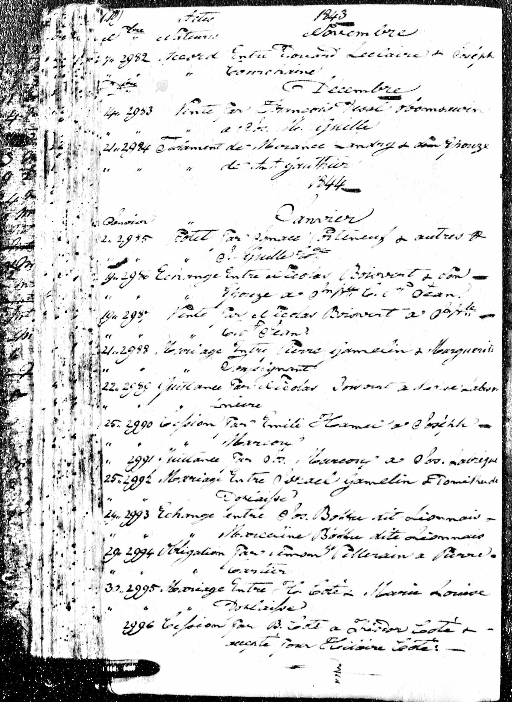
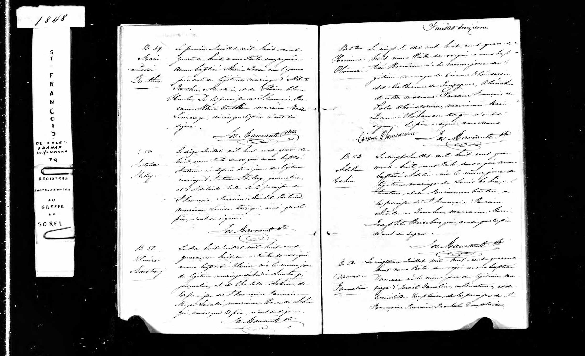
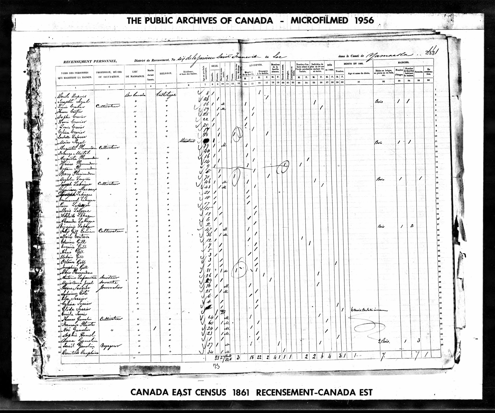
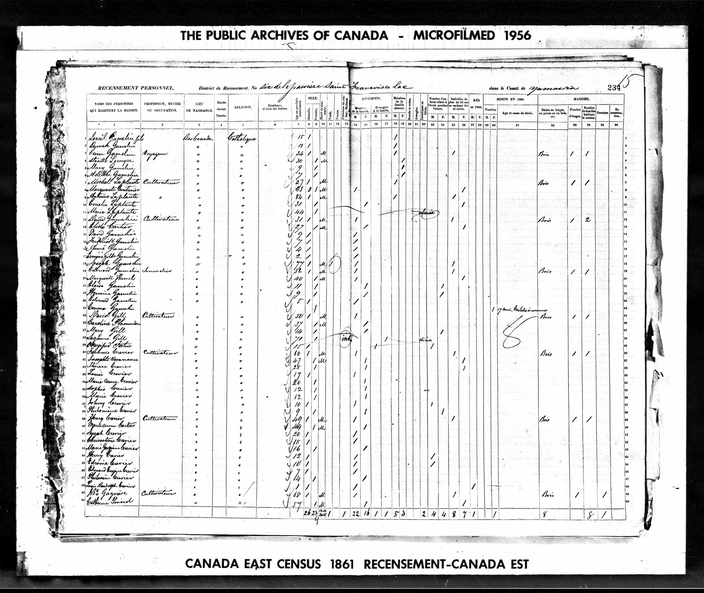
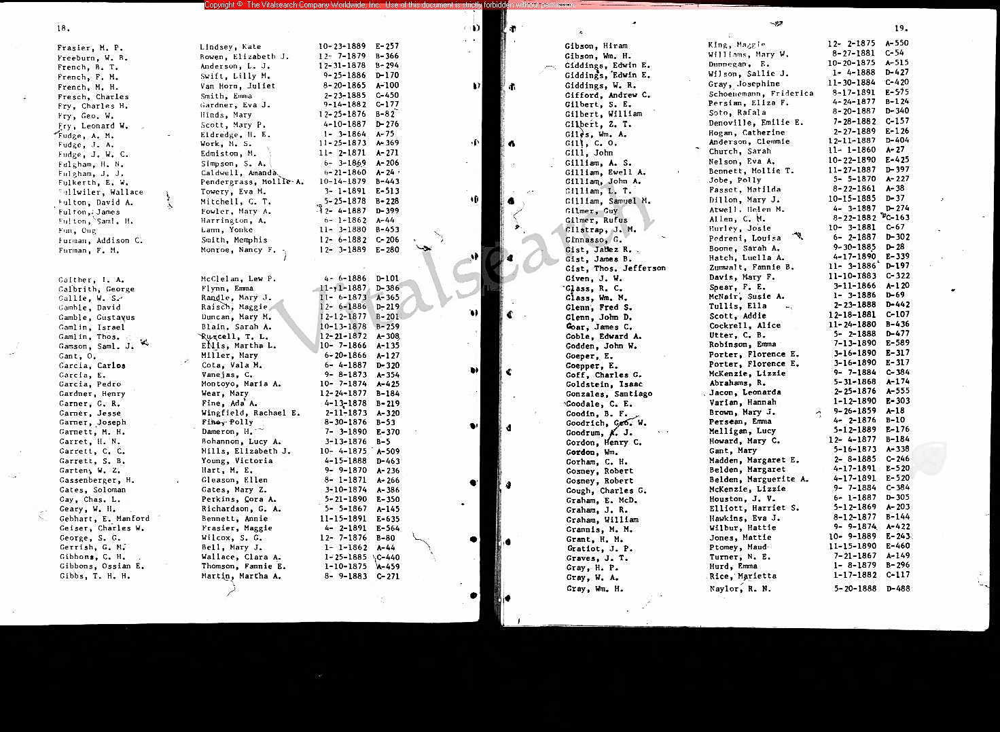
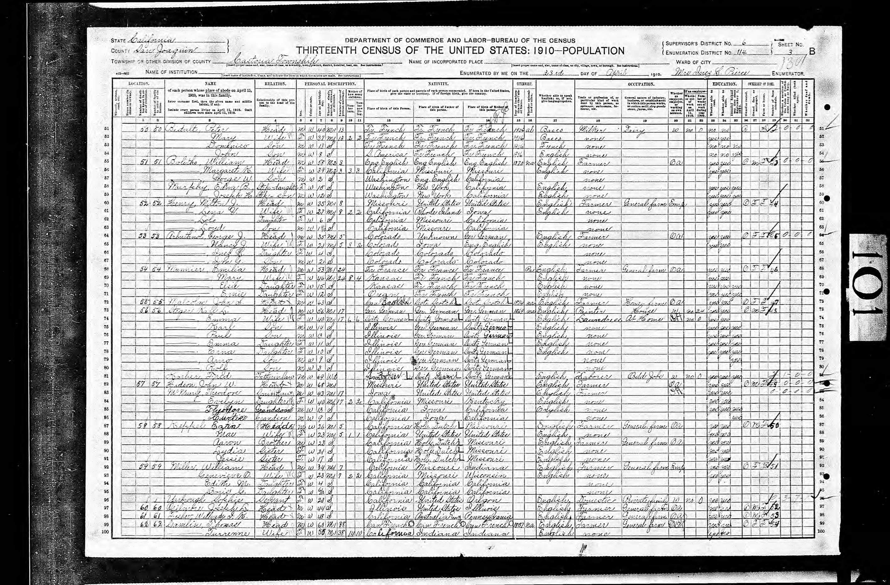
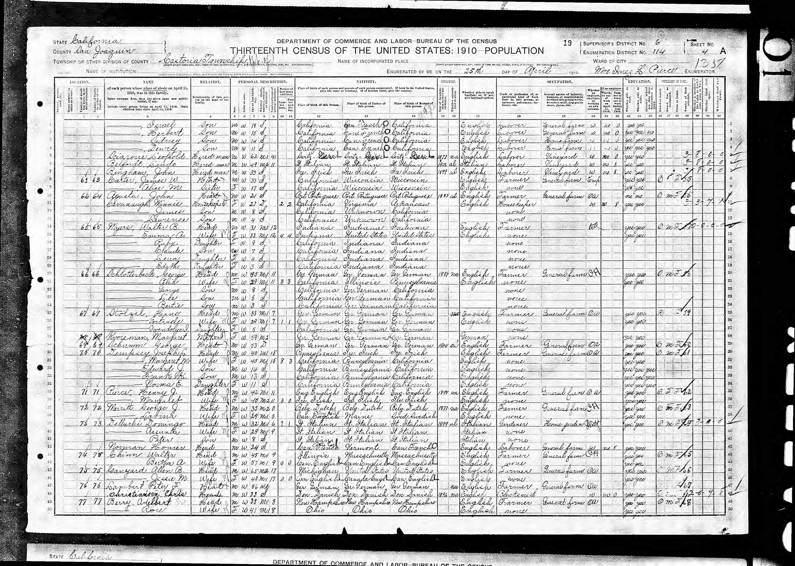

(This is a list of public records, no personal information in here). "Great" designations are relative to Michael. 

## 1845 - Marriage of Israel (GG grandfather) and Domithilde  (GG grandmother)

Source Transcription:

```
Record Type:    Contrat De Mariage (Marriage Contract) (Marriage)
Notarial Date:	25 janv. 1844 (25 Jan 1844)
Notarial Place:	Richelieu, Québec (Quebec), Canada
Marriage Date:	25 janv. 1844 (25 Jan 1844)
Notary:	        Pitt, William
Notarial Act Number:	2992
Record Description:	Mariage
Spouse:	        Israel Gamelin
```


- [Source Image](#1845-marriage-image)
- Ancestry.com Source Title: Quebec, Canada, Notarial Records, 1637-1935
- Source Page: 180
- Siurce Details: Bibliothèque Et Archives Nationales Du Québec; Montreal, QC, Canada; Collection: Fonds Cour Supérieure. District Judiciaire De Richelieu. Cote Cn603. Greffes De Notaires, 1702-1961.; District: Richelieu; Title: Pitt, William (1823-1868) 


## 1849 - Baptism of Thomas (G grandfather)

Thomas Gamelin (G Grandfather) was baptized in 1848

(note: the handwriting recognition transcribes “Damase” instead of “Thomas”)

Source Transcription:

```
Name:	Damase Gamelin		
Baptism: Age	0[0]		
Record Type:	Baptême (Baptism)		
Birth Date:	22 juill. 1848 (22 Jul 1848)		
Baptism Date:	22 juill. 1848 (22 Jul 1848)		
Baptism Place:	Odanak, Québec (Quebec), Canada		
Baptism Church:	Odanak		
Father:	Gamelin		
Mother:	Domitilde Duplaise		
Legitimate:	Y	
```	

- [Source Image](#1849-baptism-image)
- Ancestry.com Source Title: Quebec Vital and Church Records (Drouin Collection), 1621-1967
- Source Page: 14
- Source Details: Institut Généalogique Drouin; Montreal, Quebec, Canada; Drouin Collection; Author: Gabriel Drouin, Comp.

## 1861 Canada Census (family)

The 1861 census shows Thomas Gamelin (GGG grandfather), Israel Gamelin (GG grandfather),  Domithilde Dauplaise (GG grandmother), Israal Gamelin, and Thomas Gamelin (G grandfather)

I think Israel, Domithilde, Israel (Jr) and Thomas may have been in the US at that time, but likely Thomas (sr) stated them as living in his dwelling. 

- [Source Image](#1861-Census-Image)
- Ancestry.com Source Title: 1861 Census of Canada
- Source Page: 238, 239
- Source Details: Library and Archives Canada; Ottawa, Ontario, Canada; Census Returns For 1861; Roll: C-1331

## 1872 Thomas (G grandfather) marries Turrenne (G grandmother)

Source Transcription:

```
Name	Thos Gamlin
Gender	Male
Event Type	Marriage
Marriage Date	21 Dec 1872
Marriage Place	Tulare, California, USA
Spouse	T L Purcell
```

- [Source Image](#1872-marriage-image)
- Ancestry.com Source Title: California, U.S., County Birth, Marriage, and Death Records, 1849-1980
- Source Page: 11
- Source Details: California Department of Public Health, courtesy of www.vitalsearch-worldwide.com. Digital Images.


## 1882 Thomas Gamlin (G grandfather) Naturalization

(Thomas Gamlin's father was Thomas Israel but generally went by Israel because his father was named Thomas, so Thomas Jr looks reasonable for my G grandfather)

Source Transcription:

```
Name	Thomas Gamlin Jr
Record Type	Naturalization Declaration
Declaration Date	13 May 1882
Declaration Place	Fresno, California, USA
Description	Naturalizations, Vol B,D, 1875-1888, 1892-1896
Relation to Head	Self (Head)
```

## 1892 Israel (grandfather) born

Source Transcription:

```
Name	Israel Gamlin
Gender	Male
Birth Date	28 May 1892
Birth Place	California
Death Date	22 Jun 1971
Death Place	Fresno
```

- Ancestry.com source title: California Death Index, 1940-1997


## 1910 US Census

This shows Thomas (G grandfather), wife Turrenne (G grandmother) and son Israel (grandfather). 

Transcription of immigration year shows 1807, that looks like a transcription error of 1857. Family history says they moved to the US that year.  

Source Transcription:

```
Name	Thomas Gamlin
Age in 1910	60
Birth Date	1850
Birthplace	Canada French
Home in 1910	Castoria, San Joaquin, California, USA
Sheet Number	3b
Race	White
Gender	Male
Immigration Year	1807
Relation to Head of House	Head
Marital Status	Married
Father's Birthplace	Canada French
Mother's Birthplace	Canada French
Native Tongue	English
Occupation	Farmer
Industry	General Farm
Employer, Employee or Other	Own Account
Home Owned or Rented	Own
Home Free or Mortgaged	Free
Farm or House	Farm
Naturalization Status	Naturalized
Able to read	Yes
Able to Write	Yes
Enumeration District Number	0114
Years Married	38
Enumerated Year	1910
Neighbors	View others on page
```

Ancestry.com Source Detail: 1910 United States Federal Census 
Source Page: 6, 7


## 19xxx Thomas Gamlin (G grandfather) dies

This is a death index, not certificate

Source Transcription:

```
Name	Thomas Gamlin
Birth Year	abt 1850
[abt 1850]
Death Date	7 Apr 1933
Age at Death	83
Death Place	Placer, California, USA
```

Ancestry.com Source Detail: California, U.S., Death Index, 1905-1939

## 1925 Israel Gamlin (grandfather) Marries Mabel Foster (grandmother)

(Michael has original copy marriage certificate)


## 1930 Virginia (Mother) born

```
Name	Virginia Rose Gamlin
Birth Date	20 Nov 1930
Gender	Female
Mother's Maiden Name	Foster
Birth County	Placer
```

Ancestry.com Source Detail: California Birth Index, 1905-1995


# Appendix

## 1845 Marriage Image


## 1849 Baptism Image


## 1861 Census Image



## 1872 Marriage Image


## 1910 Census




